Cloud Resume Challenge – AWS Implementation

This project is my implementation of the Cloud Resume Challenge, built on AWS using real cloud and DevOps skills.
The goal is to deploy a fully functional, secure, serverless resume website with a live visitor counter.

Work in progress..

Architecture diagram:

Flow:

    1. User Interaction:

    Users access the secured HTML website by sending an HTTPS request.

    The website includes Remsume created wiht HTML and CSS, it also show visitor count which is updated in real-time by JS function.

    2. CloudFront & S3:

    The HTTPS request is routed through Amazon CloudFront, a Content Delivery Network (CDN).

    CloudFront serves the static HTML website (e.g., index.html, styles.css) hosted in an S3 bucket.

    CloudFront ensures fast delivery of the static content to the user, with a global network of edge locations.

    3. Frontend JS Fetch Request:

    The JavaScript on the front end (the user's browser) sends a GET request to the API Gateway to retrieve the visitor count.

    4. API Gateway:

    API Gateway acts as a gateway between the frontend and backend.

    It receives the request and invokes the Lambda function to process the request and retrieve the visitor count.

    5. Lambda Function:

    The Lambda function performs the necessary business logic to interact with DynamoDB, the database that holds the visitor count.

    The Lambda function reads the visitor count, increments it, and writes the updated count back to DynamoDB.

    It then responds with the updated visitor count in JSON format ({count: N}).

    6. DynamoDB:

    DynamoDB is the NoSQL database that stores the visitor count.

    Every time the Lambda function processes a request, it updates the visitor count in DynamoDB.

    7. GitHub Actions (CI/CD):

    GitHub Actions are triggered when changes are made to the Frontend repository (e.g., when new HTML or CSS content is committed).

    The Actions use GitHub Secrets (e.g., AWS credentials) to securely deploy the updated content to S3 and invalidate CloudFront to ensure the new content is served.

    8. Frontend Deployment:

    After a new commit is pushed to the Frontend repository on GitHub, the Frontend pipeline (part of GitHub Actions) is triggered.

    The pipeline uses AWS access keys from GitHub Secrets to sync the updated static files to the S3 bucket.

    If necessary, CloudFront is invalidated to ensure that users receive the latest version of the website.

Screenshots:

Sample resume from cloudfront url with visitor counts
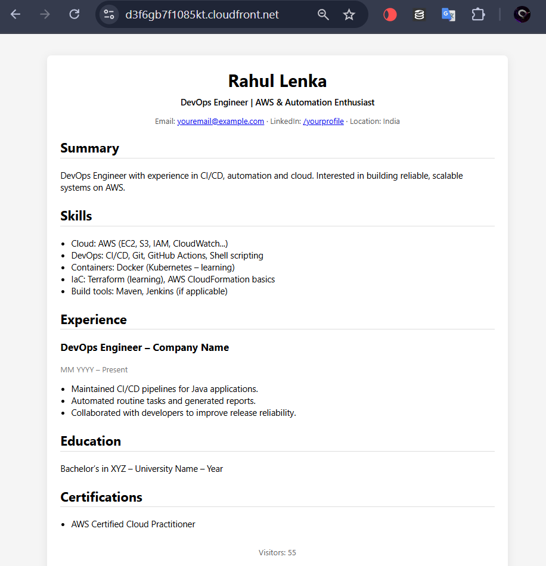

s3 bucket with static resume content
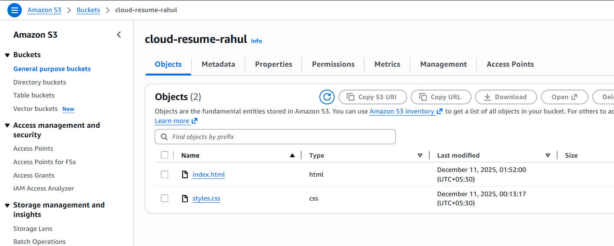

API gateway with GET reoute and lambda integration
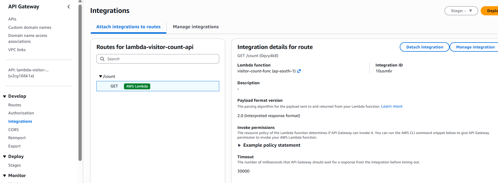

Lambda function with API gateway trigger
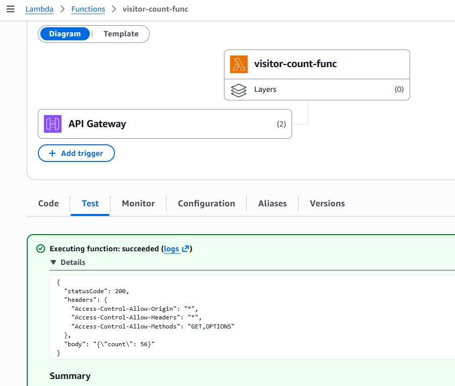

DynamoDB visitor-count table
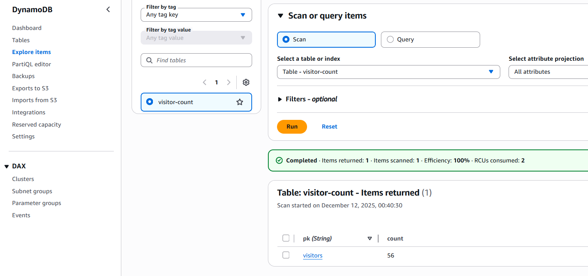

Frontend github action
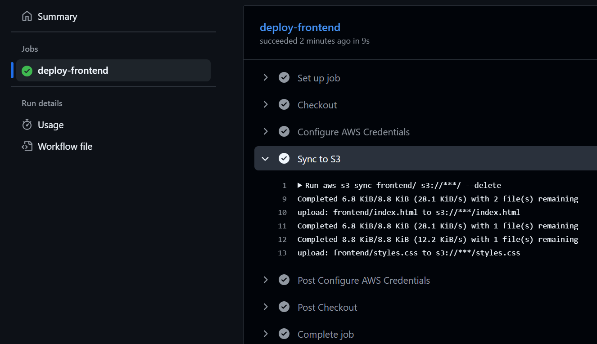

Before running the pipeline
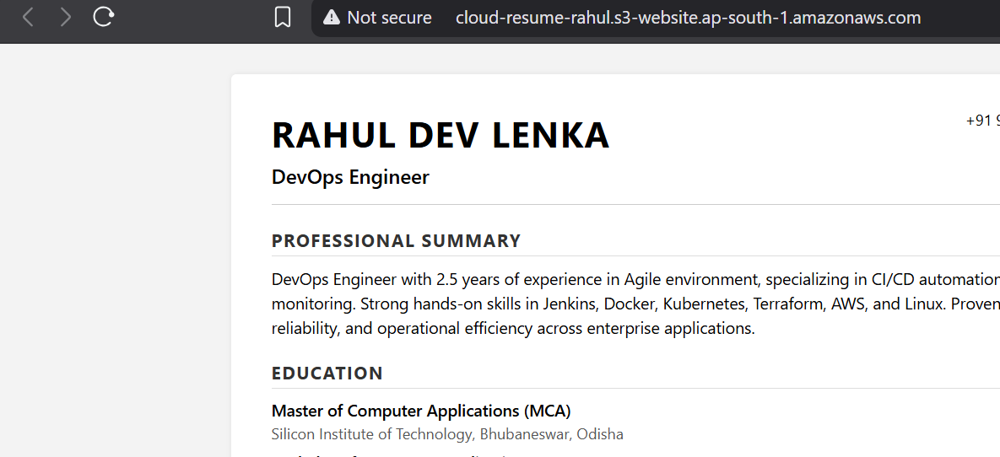

After running the pipeline
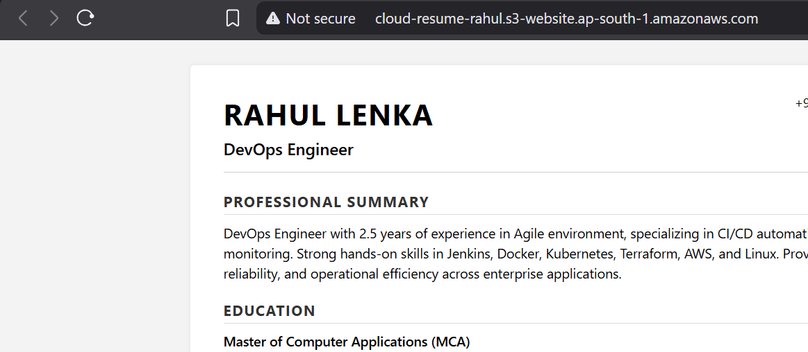

before cloudfront invalidation
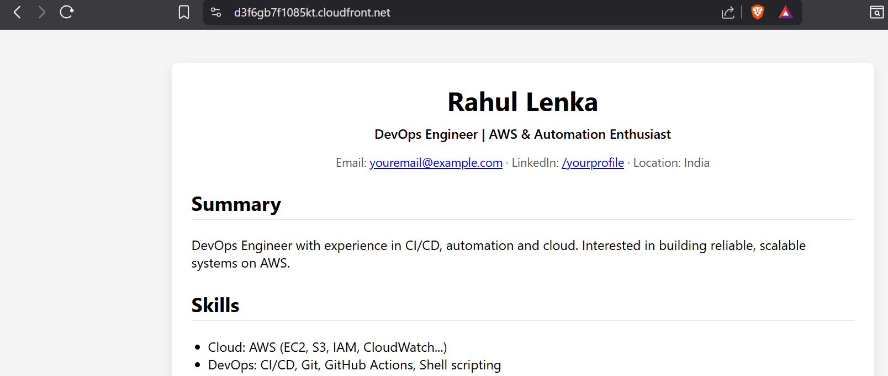

after cloudfront invalidation
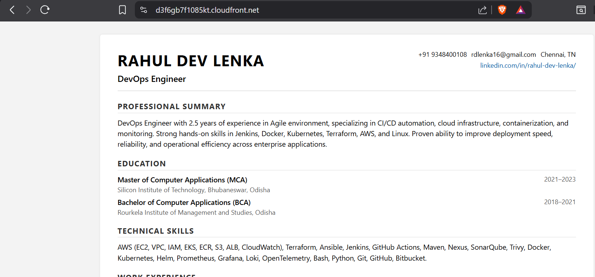

it created and updated in console
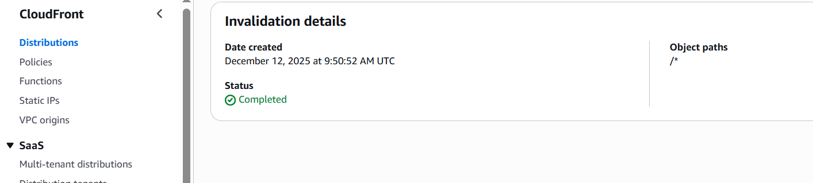